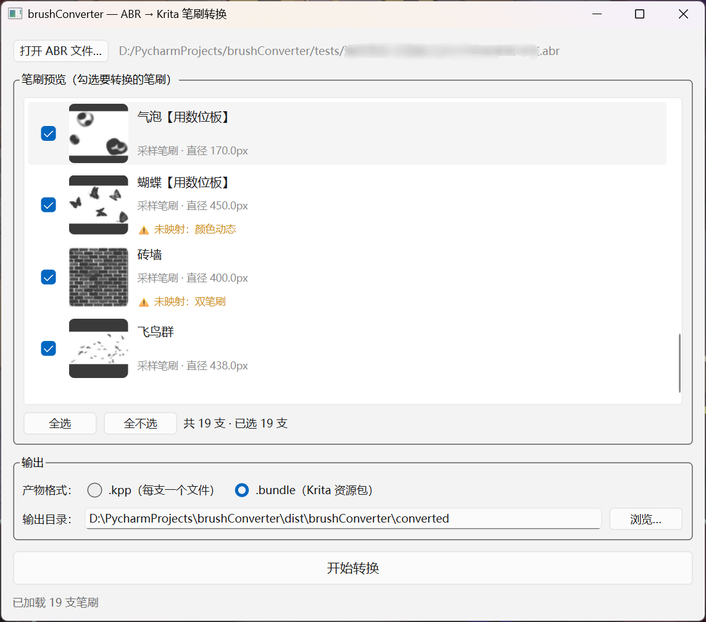

# brushConverter

Convert Photoshop brush sets (`.abr`) into Krita brushes (`.kpp` presets / `.bundle` resource packs), with automatic brush-parameter mapping. Ships as both a command-line tool and a PySide6 GUI. **v1.1.0**

Photoshop 笔刷（`.abr`）转 Krita 笔刷（`.kpp` / `.bundle`）工具，支持参数自动映射，提供命令行与图形界面两种方式。

## 使用指南

### 图形界面



打开 .abr → 预览每支笔尖缩略图与名称 → 勾选要转换的笔刷（支持全选/全不选）→ 选择产物格式（`.kpp` 每支一个文件，或 `.bundle` Krita 资源包）→ 选择输出目录 → 点击"开始转换"。含未映射参数（双笔刷/颜色动态/湿边等）的笔刷会有 ⚠ 标注，转换时会先弹窗提醒确认。纹理（`patt`）已支持。

下载 `brushConverter-*-win64.zip`（见 [releases](https://github.com/yxm1122/brushConverter/releases)），解压后双击 `brushConverter.exe` 即可使用。

### 命令行

下载 `brushconverter-cli-*-win64.zip` 解压后，在命令行使用 `brushconverter-cli.exe`：

```bash
brushconverter-cli.exe convert <file.abr> -o 输出目录                # 批量转换为 Krita 预设/资源包
brushconverter-cli.exe info <file.abr>                              # 查看笔刷概况（版本/区段/笔尖）
brushconverter-cli.exe extract <file.abr> -o out/ [--contact-sheet] # 导出笔尖 PNG + 总览图
```

## 环境

```
conda activate brushConverter      # Python 3.12, 含 numpy + pillow + pyside6
pip install -r requirements.txt    # 补充依赖（含 pyinstaller）
```

## 用法

```bash
python cli.py gui                                                # 启动图形界面
python cli.py info <file.abr>                                    # 打印版本/区段/笔尖列表
python cli.py extract <file.abr> -o out/ [--contact-sheet]       # 导出 PNG + info.json
python cli.py convert <file.abr> -o out/                         # 命令行批量转换
```

## 打包

项目根目录的 `*.spec` 是 PyInstaller 配置，`--onedir` 模式输出两个目录：

```bash
pyinstaller brushconverter-cli.spec    # → dist/brushconverter-cli/brushconverter-cli.exe  (62 MB, 无 GUI 依赖)
pyinstaller brushconverter-gui.spec    # → dist/brushConverter/brushConverter.exe  (155 MB, 含 PySide6)
```

- 应用图标：`assets/brushConverter.ico`（自绘蓝紫渐变 + 转换箭头 + 笔刷墨点）。
- CLI 入口：`cli.py`（console 模式）；GUI 入口：`brushConverter_gui_entry.py`（避免 `gui/__main__.py` 的开发期 sys.path hack）。
- 重新打包前可加 `--clean` 清理 `build/` 与 `dist/`。

## GUI 功能

- 打开 .abr，预览每支笔刷的笔尖缩略图与名称；
- 勾选要转换的笔刷（支持全选/全不选）；
- 产物可选 `.kpp`（每支一个文件）或 `.bundle`（Krita 资源包）；
- 含双笔刷/颜色动态/湿边等无法映射参数的笔刷会弹出提醒（纹理已支持映射）。

## 转换说明

- 支持 v1/v2 旧格式 + v6.1/v6.2 新格式；采样笔尖转为内嵌 PNG 笔尖，计算笔刷映射为 Krita auto_brush。
- 参数映射见 `docs/parameter-mapping.md`（完整清单）。
- 交付物：Krita 5.x 资源包 `.bundle`（一键导入）+ 自包含 `.kpp`（笔尖 base64 内嵌）。
- 纹理（ABR `patt`）已支持：PNG 内嵌 + 缩放/深度（可随压感）/反相/混合模式/亮度/对比度映射。
- 双笔刷、颜色动态、湿边等暂不映射（引擎差异大）。
- 想了解实现原理与开发中踩过的坑，见 `docs/developer-guide.md`。

## 在 Krita 中验证

1. 设置 → 管理资源 → 导入资源包，选择生成的 `.bundle`；
2. 或把 `converted/kpp/*.kpp` 复制到 Krita 资源目录的 `paintoppresets/` 下，重启 Krita。

## 相关文档

- [`docs/developer-guide.md`](docs/developer-guide.md) — 项目结构、ABR 解析原理、参数映射、KPP/bundle 生成，以及开发过程中踩过的所有坑（`.kpp` 是 PNG 不是 ZIP、笔尖是 PNG 不是 GBR、角度归一化到 [0,360)、硬度 fade = Hrdn/100 等）。
- [`docs/parameter-mapping.md`](docs/parameter-mapping.md) — ABR → Krita 各字段的逐项映射清单（尺寸、动态、散布、纹理和 bVTy 控制源编码等）。
- [`releases/RELEASE_NOTES.md`](releases/RELEASE_NOTES.md) — v1.1.0 变更与已知限制。
